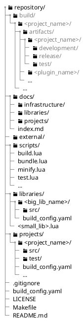

```plantuml
@startsalt
{
    {T
    + <&folder> project1
    ++ <&folder> module1/
    +++ file1.lua
    ++ <&folder> module2/
    +++ file2.lua
    +++ preserved1.lua
    ++ metadata.lua
    ++ file3.lua
    ++ init.lua
    ++ preserved2.lua
    }
}
@endsalt
```

# Architecture of the build system, test and deployment system

## Build pipeline


## Repository structure



## Artifact structure

When you have the following example project structure.

The project contains multiple modules and source files. It also contains two preserved files. The init file serves as the entrypoint

```plantuml
@startsalt
{
    {T
    + <&folder> project1
    ++ <&folder> module1/
    +++ file1.lua
    ++ <&folder> module2/
    +++ file2.lua
    +++ preserved1.lua
    ++ build_config.yaml
    ++ file3.lua
    ++ init.lua
    ++ preserved2.lua
    }
}
@endsalt
```



### Bundled

With the given example project a bundled artifact would look like this:

- All files are combined inside a single file called like the project root folder
- with the exception of preserved files. These files remain intact and also keep there relative structure to the project root.
- Additionally a metadata file gets generated which contains info about the artifact like revision and project version.



```plantuml
@startsalt
{
    {T
    + artifact
    ++ <&folder> module2/
    +++ preserved1.lua
    ++ metadata.lua
    ++ preserved.lua
    ++ project1.lua
    }
}
@endsalt
```

### Not bundled

With the given example project a unbundled artifact would look like this:

- All source files remain intact and keep there relative structure to the project root.
- Additionally a metadata file gets generated which contains info about the artifact like revision and project version.



# Build-configuration architecture

## Configuration hierarchy and merging

Configuration is composed in this fixed order:

```text
repository/build_config.yaml
→ projects/build_config.yaml | libraries/build_config.yaml | external/build_config.yaml
→ project/package build_config.yaml or small-package sidecar configuration
→ target
→ build type
```

The category-level configuration applies to all entries in that category. A project configuration without `targets` creates an implicit `default` target. A library configuration without `targets` is a library manifest: it supplies dependency and preserved-file settings when the library is consumed, but produces no artifact. Library targets are optional and represent independently publishable subsets.

Scalar values override inherited values. Maps merge by key, with the more-specific value winning. Lists append by default; a list can instead use `mode: replace` or `mode: clear`. `clear` has no items.

```yaml
targets:
  default:
    version: 1.0.0-alpha
    entry_point: main.lua
    dependencies:
      - lib.logging
    test:
      entry_point: TestMain.lua
      dependencies:
        mode: append
        items:
          - lib.testing
```

Build-target names, project names, and group names use `^[A-Za-z0-9](?:[A-Za-z0-9_]*[A-Za-z0-9])?$`. The stable target identity is `<project>/<target>`; the target name also determines its artifact name. `default` uses the project name as its artifact name.

## Module identity and packages

The logical module name is a module's stable identity. Repository and artifact paths are mappings of that identity. Project modules have no prefix, library modules use `lib.`, external modules use `external.`, and test modules use `test.`. Defaults are `source_root: src/` and `test_source_root: test/`; entry points and preserved paths are relative to the applicable source root.

Libraries and external packages share two package shapes beneath their respective category roots:

```text
libraries/logging.lua                    → lib.logging
libraries/logging/src/init.lua           → lib.logging
libraries/logging/src/format/json.lua    → lib.logging.format.json
external/example.lua                     → external.example
external/example/src/init.lua            → external.example
```

`library_search_path` and `external_search_path` name category roots (`libraries/` and `external/` by default), not a package's `src/` directory. A same-name single-file and directory package is an error because both map to the same module. Small packages that need configuration use a sidecar file such as `libraries/logging.build_config.yaml`; large packages use `<package>/build_config.yaml`.

An `init.lua` defines a public interface for its package subtree. Code outside that package may require only the interface module; code inside the package can require its internal modules. Declared dependencies name complete packages, with an optional `lib.` or `external.` prefix. An unprefixed name searches libraries before external packages. Static dependency cycles are errors.

## Artifact selection and layout

All build types include only the static dependency closure of their resolution roots. Development and Release use the effective normal entry point. Test first discovers `Test*.lua` files under `test_source_root`; every discovered suite and the test environment/effective test entry point are roots. Tests use the `test.` namespace and are emitted below `test/`, while production modules retain their ordinary namespaces.

Development and Test artifacts preserve the selected modules as files. Release artifacts bundle and minify selected modules, except preserved modules. A preserved module and its complete static runtime closure are emitted as files; runtime-file `require()` calls are retained, and preservation wins when a module is selected both for bundling and runtime emission.

Artifacts are written below `build/<project>/artifacts/<artifact-name>/<build-type>/`. A Release build requires a clean worktree, a repository-level `artifact_base_url`, a full source commit SHA, and a target version. Development and Test builds may lack a version but report a warning.

Each artifact contains generated metadata with its name, optional version, source revision, artifact base URL, and a `FILES` manifest. Each manifest entry contains an artifact-relative `path` and the file's SHA-256 checksum so an installer can verify individually downloaded files.

`./` means relative to the `src/` folder of the current project.
`/` means relative to the repository root.

# Dependency Scope and Type

Dependency scope and dependency type are deliberately separate concepts.

**Dependency Scope**

- Target scope: available to every build type of a target.
- Build-type scope: available only to the specific build type.

The same scope distinction applies to entry points: a target may define a default entry point and a build type may override it.

**Dependency Type**

- Static: resolved by the build system and eligible for inclusion in the artifact.
- Dynamic: resolved at runtime and not included in the referencing artifact.

The resolver distinguishes them by the form of the require() argument:

- require("module.name") → static
- require(variable) → dynamic

## Testing

The repository uses a test architecture based on the xUnit architecture.

Test cases are organized into test suites. A suite is therefore a collection of logically connected test cases.
A test case is divided into four phases: setup, execution, verification and teardown. In the first phase all necessary prerequisites for the test are established and the test fixture is prepared. The test fixture encompasses the set of all preconditions, test data and initialization steps required to execute a test case. The second phase involves the actual execution of the test against the system under test (SUT). The SUT refers to the software unit whose behavior is being verified in the specific test case. For example, a class, a method, a module, or an entire system. Subsequently, the next phase verifies whether the expected result has occurred. To perform the verification the test system provides a set of assertion functions. In the final phase, any persistent data is cleaned up to restore the initial state that existed prior to the test. In automatic execution, all test cases are run by a test runner. The runner can automatically discover test cases using a test discovery mechanism.

A test suite is defined as a class starting with the prefix `Test` and extending the class `TestSuite` from the `testing` library. Usually a test suite SHOULD be named the same and preserve it relative location as the source file or class being tested. For example if you want to test the class `user_management/Register` you create a test class named `TestRegister` inside a `user_management` folder. A test suite file MUST only contain a single test suite and return the suite at the end.

A test suite can contain multiple test cases, setup and teardown methods for the suite and the test cases.

A test case is defined as a method that starts with the prefix `test_`. For example `function TestRegister:test_new_user_with_malformed_mail_should_throw()`. A test case should follow the perviously discussed structure. First prepare the SUT, then execute the function you want to test, verify the results and clean everything up.

If you have multiple test that require the same setup procedure you can add a `setup()` method to the test suite class. This class is run before every test case inside this suite. The same applies to the `teardown()` method. This method is run after each test case. For initialization that needs to be executed only once for the hole test suite you can add a `setupTestSuite()` method. This method is executed before the first test case is executed. The method `teardownTestSuite()` is executed after all test cases of the suite have been executed.

If you have a test case that you want to exclude from automatic execution (for example test cases that broke because of a change and still need to be updated) you can exclude them by prefixing the test case with `DISABLED_`. The same principle can be applied to a test suite. For example `function TestRegister:DISABLED_test_new_user_with_malformed_mail_should_throw()` or `DISABLED_TestRegister = class.class(testing.TestSuite)`.

Disabling a broken test case SHOULD be preferred over commenting out a test case since disabled test cases will still be found by the test runner and are listed inside the test result as skipped test cases. This is a clear reminder that you still have to fix a test case.

Additionally you can create a test environment class at the root of the test src folder. This class inherits the class `TestEnvironment` from the `testing` library and can contain the test entry point `main()`, a environment `setup()` and `teardown()` method. The entry point method is executed before the complete test execution an can be used to configure the test system and process program parameter. Setup/ teardown methods are executed before/after the test execution. So before the first test suite/ after the last test suite.

A test listener can used to perform an action on test lifecycle and execution events. This can be used for example to output the test results to a csv file or provide additional information to the command line output. Test listeners can be registered inside the test environment entry point.
