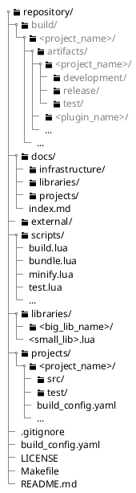

# Architecture of the build system, test and deployment system

## Build pipeline


## Repository structure



## Artifact structure

When you have the following example project structure.

The project contains multiple modules and source files. It also contains two preserved files. The init file serves as the entrypoint

```plantuml
@startsalt
{
    {T
    + <&folder> project1
    ++ <&folder> module1/
    +++ file1.lua
    ++ <&folder> module2/
    +++ file2.lua
    +++ preserved1.lua
    ++ build_config.yaml
    ++ file3.lua
    ++ init.lua
    ++ preserved2.lua
    }
}
@endsalt
```



### Bundled

With the given example project a bundled artifact would look like this:

- All files are combined inside a single file called like the project root folder
- with the exception of preserved files. These files remain intact and also keep there relative structure to the project root.
- Additionally a metadata file gets generated which contains info about the artifact like revision and project version.



```plantuml
@startsalt
{
    {T
    + artifact
    ++ <&folder> module2/
    +++ preserved1.lua
    ++ metadata.lua
    ++ preserved.lua
    ++ project1.lua
    }
}
@endsalt
```

### Not bundled

With the given example project a unbundled artifact would look like this:

- All source files remain intact and keep there relative structure to the project root.
- Additionally a metadata file gets generated which contains info about the artifact like revision and project version.


```plantuml
@startsalt
{
    {T
    + <&folder> project1
    ++ <&folder> module1/
    +++ file1.lua
    ++ <&folder> module2/
    +++ file2.lua
    +++ preserved1.lua
    ++ metadata.lua
    ++ file3.lua
    ++ init.lua
    ++ preserved2.lua
    }
}
@endsalt
```

# Build configuration

Could look something like this:

> [NOTE] Not the final

```yaml
ccmeserver:
  version: 1.0.0
  entrypoint:
    - src/main.lua
  dependencies:
    - class.lua
    - logging.lua
  test:
    dependencies:
      - test.lua
    entrypoint:
      - test/main.lua

```

# Module Identity

The logical module name is the stable identity of a module. Repository source paths and artifact paths are mappings of that identity.

Default namespaces:

Project modules: no namespace prefix
Shared libraries: lib
External code: external
Default source roots:

Projects: projects/<project>/src/
Shared libraries: lib/src/
External code: external/
These defaults are configurable through hierarchical build configuration.

## Module resolution

To create a artifact it is important to first find all required dependencies inside the repository. Since the repository holds multiple projects, shared libraries and external source code, the repository structure is vastly different from the final artifact structure.

The process of mapping the module names used inside a `require()` statement to a file path inside the repository is called module resolution.

The module name is defined by its relative location based on the search_path of the dependency type while replacing `/` with `.` and removing the file type `.lua`.

For example another module from the project `/projects/project1/src/module1/file1.lua` can be required with `module1.file`.
A shared library `/libraries/src/lib1.lua` can be required with `lib.lib1`

To find the source files inside the repo the module resolver uses defined search paths. These search paths can also be modified using the build configuration.

The search paths have the following default values:

```yaml
project_prefix=""
project_search_path="./"
library_prefix="lib."
library_search_path = "/libraries/src/"
external_prefix="external."
external_search_path = "/external/"
```

`./` means relative to the `src/` folder of the current project.
`/` means relative to the repository root.

# Dependency Scope and Type

Dependency scope and dependency type are deliberately separate concepts.

**Dependency Scope**

- Target scope: available to every build type of a target.
- Build-type scope: available only to the specific build type.

The same scope distinction applies to entry points: a target may define a default entry point and a build type may override it.

**Dependency Type**

- Static: resolved by the build system and eligible for inclusion in the artifact.
- Dynamic: resolved at runtime and not included in the referencing artifact.

The resolver distinguishes them by the form of the require() argument:

- require("module.name") → static
- require(variable) → dynamic

## Testing

The repository uses a test architecture based on the xUnit architecture.

Test cases are organized into test suites. A suite is therefore a collection of logically connected test cases.
A test case is divided into four phases: setup, execution, verification and teardown. In the first phase all necessary prerequisites for the test are established and the test fixture is prepared. The test fixture encompasses the set of all preconditions, test data and initialization steps required to execute a test case. The second phase involves the actual execution of the test against the system under test (SUT). The SUT refers to the software unit whose behavior is being verified in the specific test case. For example, a class, a method, a module, or an entire system. Subsequently, the next phase verifies whether the expected result has occurred. To perform the verification the test system provides a set of assertion functions. In the final phase, any persistent data is cleaned up to restore the initial state that existed prior to the test. In automatic execution, all test cases are run by a test runner. The runner can automatically discover test cases using a test discovery mechanism.

A test suite is defined as a class starting with the prefix `Test` and extending the class `TestSuite` from the `testing` library. Usually a test suite SHOULD be named the same and preserve it relative location as the source file or class being tested. For example if you want to test the class `user_management/Register` you create a test class named `TestRegister` inside a `user_management` folder. A test suite file MUST only contain a single test suite and return the suite at the end.

A test suite can contain multiple test cases, setup and teardown methods for the suite and the test cases.

A test case is defined as a method that starts with the prefix `test_`. For example `function TestRegister:test_new_user_with_malformed_mail_should_throw()`. A test case should follow the perviously discussed structure. First prepare the SUT, then execute the function you want to test, verify the results and clean everything up.

If you have multiple test that require the same setup procedure you can add a `setup()` method to the test suite class. This class is run before every test case inside this suite. The same applies to the `teardown()` method. This method is run after each test case. For initialization that needs to be executed only once for the hole test suite you can add a `setupTestSuite()` method. This method is executed before the first test case is executed. The method `teardownTestSuite()` is executed after all test cases of the suite have been executed.

If you have a test case that you want to exclude from automatic execution (for example test cases that broke because of a change and still need to be updated) you can exclude them by prefixing the test case with `DISABLED_`. The same principle can be applied to a test suite. For example `function TestRegister:DISABLED_test_new_user_with_malformed_mail_should_throw()` or `DISABLED_TestRegister = class.class(testing.TestSuite)`.

Disabling a broken test case SHOULD be preferred over commenting out a test case since disabled test cases will still be found by the test runner and are listed inside the test result as skipped test cases. This is a clear reminder that you still have to fix a test case.

Additionally you can create a test environment class at the root of the test src folder. This class inherits the class `TestEnvironment` from the `testing` library and can contain the test entry point `main()`, a environment `setup()` and `teardown()` method. The entry point method is executed before the complete test execution an can be used to configure the test system and process program parameter. Setup/ teardown methods are executed before/after the test execution. So before the first test suite/ after the last test suite.

A test listener can used to perform an action on test lifecycle and execution events. This can be used for example to output the test results to a csv file or provide additional information to the command line output. Test listeners can be registered inside the test environment entry point.
