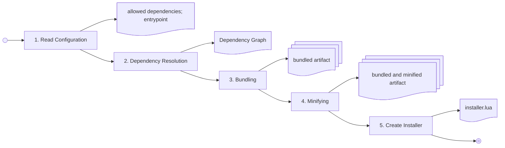

# Architecture of the build system, test and deployment system

## 1. Build pipeline

The build pipeline is structured into clearly separated stages to ensure modular processing and clean error isolation. Each stage has a single, well-defined responsibility:

1. **Configuration Loading & Merging**: The system loads build configurations following the configuration hierarchy (Repository → Category → Package → Target → Build Type). Merging rules apply (scalar override, map merge, and list appending/replacement/clearing).
2. **Dependency Resolution**: Static dependencies are parsed from `require()` calls and mapped to packages declared in the configuration. The dependency resolver constructs the directed dependency graph starting from the defined entry point.
3. **Dependency Validation**: The system validates the resolved dependency graph against declared package bounds, identifying any undeclared dependencies (error) or unused declared dependencies (warning).
4. **Source Packaging & Bundling**: Based on the active build type:
   - *Development / Test*: Individual modules are mapped to their logical namespaces and prepared for unbundled file emission.
   - *Release*: The static dependency closure is bundled into a single file, except for explicitly preserved files.
5. **Minification**: Release bundles are minified by stripping comments and unnecessary white spaces.
6. **Artifact Assembly & Metadata Generation**: The files are packaged, and a standard `metadata.lua` manifest is generated containing the artifact metadata and individual file checksums.



## 2. Repository structure

```text
/ (Repository Root)
├── build_config.yaml                    # Repository-level configuration
├── projects/                            # Application and plugin packages
│   ├── build_config.yaml                # Category-level projects configuration
│   └── <project>/
│       ├── build_config.yaml            # Project-level configuration
│       └── src/                         # Project source files (default source_root)
├── libraries/                           # Shared library packages
│   ├── build_config.yaml                # Category-level libraries configuration
│   ├── <library>.lua                    # Small library (single file)
│   ├── <library>.build_config.yaml      # Small library sidecar configuration
│   └── <library>/
│       ├── build_config.yaml            # Large library configuration
│       └── src/                         # Large library source files
├── external/                            # External vendored packages
│   ├── build_config.yaml                # Category-level external configuration
│   ├── <package>.lua                    # Small external package (single file)
│   ├── <package>.build_config.yaml      # Small external package sidecar configuration
│   └── <package>/
│       ├── build_config.yaml            # Large external package configuration
│       └── src/                         # Large external package source files
└── build/                               # Write-only build output directory (ignored)
```

### 3. Artifact Structure

Every build target produces exactly one logical build artifact, whose output files are structured based on the active build type.

### 3.1. Bundled Artifact (Release Build Type)

In a Release build, the artifact is bundled and minified to minimize storage footprints in ComputerCraft environments:

- **Bundled Core**: All statically resolved source files in the target's dependency closure are combined into a single, main executable file. The main file is named after the target name (or after the project name if using the default target).
- **Preserved Files**: Explicitly preserved modules, directory paths, or files remain intact as separate files, preserving their relative folder structure under the project's source root.
- **FILES Manifest**: A generated `metadata.lua` file is included, which lists all files in the artifact and their SHA-256 checksums to enable installer-level verification.

### 3.2. Unbundled Artifact (Development and Test Build Types)

Development and Test builds preserve the original module structure to facilitate step-by-step debugging:

- **Preserved Module Structure**: All statically resolved source modules remain intact as individual files and keep their relative directory layout corresponding to their logical module names.
- **Unminified Sources**: Comments, formatting, and white spaces are preserved.
- **FILES Manifest**: A generated `metadata.lua` file contains artifact metadata and file checksums, identical to the Release manifest.

---

## 4. Build-configuration architecture

Example config file

```yaml
targets:
  default:
    version: 1.0.0-alpha
    entry_point: main.lua
    dependencies:
      - lib.logging
    test:
      entry_point: TestMain.lua
      dependencies:
        mode: append
        items:
          - lib.testing
```

### 4.1. Configuration hierarchy and merging

Configuration is composed in this fixed order:

```text
repository/build_config.yaml
→ projects/build_config.yaml | libraries/build_config.yaml | external/build_config.yaml
→ project/package build_config.yaml or small-package sidecar configuration
→ target
→ build type
```

The category-level configuration applies to all entries in that category. A project configuration without `targets` creates an implicit `default` target. A library configuration without `targets` is a library manifest: it supplies dependency and preserved-file settings when the library is consumed, but produces no artifact. Library targets are optional and represent independently publishable subsets.

#### Merging Behavior

- **Scalars**: A child configuration value completely overrides any inherited value from higher levels.
- **Maps**: Merged by key, with the more-specific child value winning in case of key collisions.
- **Lists**: Merged using one of three explicit list modes:
  - **Append (Default)**: Items from the child list are appended to the inherited list.
  - **Replace (`mode: replace`)**: The child list completely replaces the inherited list.
  - **Clear (`mode: clear`)**: The inherited list is entirely cleared, resulting in an empty list.

Build-target names, project names, and group names use `^[A-Za-z0-9](?:[A-Za-z0-9_]*[A-Za-z0-9])?$`. The stable target identity is `<project>/<target>`; the target name also determines its artifact name. `default` uses the project name as its artifact name.

#### Target Identity and Artifact Naming

- **Stable Identity**: The stable logical identity of a build target is `<project>/<target>`. This identity is used by the build cache, build directory, and diagnostic system.
- **Artifact Naming**: The build target name determines its output artifact name. The default target, named `default`, uses the project name as its artifact name.
- **Identifier Constraints**: Target names, project names, and group names must match the regular expression: `^[A-Za-z0-9](?:[A-Za-z0-9_]*[A-Za-z0-9])?$`.
- **Implicit Target**: A project configuration without targets creates an implicit default target. A library or external package configuration without targets behaves as a manifest only, supplying dependencies and preservation settings but generating no artifact.

### 4.2. Module Identity and Packages

The logical module name serves as a module's stable identity within the Lua ecosystem, mapping physical repository paths to import namespaces:

- **Namespaces and Prefixes**: Project modules have no prefix. Shared libraries use a `lib.` prefix (e.g., `lib.logging`). External modules use an `external.` prefix (e.g., `external.json`). Test modules use a `test.` prefix (e.g., `test.user_management.TestRegister`).
- **Source Roots**: Defaults are `source_root: src/` and `test_source_root: test/`, configured relative to the package root. All entry points and preserved paths are interpreted relative to the active source root.
- **Package Shapes**: Shared libraries and external packages exist in two shapes beneath their category roots (configured by `library_search_path` and `external_search_path`, which default to `libraries/` and `external/` respectively):
  1. *Small Package*: A single file located at `libraries/<name>.lua` or `external/<name>.lua`. Small packages that require static dependencies utilize a sidecar configuration file (`libraries/<name>.build_config.yaml` or `external/<name>.build_config.yaml`).
  2. *Large Package*: A package directory located at `libraries/<name>/` or `external/<name>/` containing `build_config.yaml` at its root, with its sources inside a `src/` directory.
- **Name Collisions**: A same-name small-file package and directory package within the same category (e.g., `libraries/logging.lua` and `libraries/logging/`) is a build-time resolution error.
- **Public Interfaces**: An `init.lua` file defines a public interface for its package subtree. External consumers outside the package are restricted to require *only* the public interface (e.g., `require("lib.logging")`) and are forbidden from importing internal descendants recursively. Code inside the package itself is caller-aware and is permitted to import its internal modules (e.g., `require("lib.logging.internal_module")`).

```text
libraries/logging.lua                    → lib.logging
libraries/logging/src/init.lua           → lib.logging
libraries/logging/src/format/json.lua    → lib.logging.format.json
external/example.lua                     → external.example
external/example/src/init.lua            → external.example
```

### 4.3. Artifact Selection and Layout

All build types include *only* the static dependency closure of their resolution roots; unreachable source files are omitted from the output.

- **Development Builds**: Resolve dependencies from the target's effective entry point and output the resolved closure as unbundled, unminified files under `build/<project>/artifacts/<artifact-name>/development/`.
- **Release Builds**: Resolve dependencies from the target's effective entry point, bundle and minify them into a single executable, and copy preserved files. They require a clean Git worktree, a configured repository-level `artifact_base_url`, a full source commit SHA, and a mandatory target version.
- **Test Builds**: Test builds discover `Test*.lua` files (CamelCase class-definition naming) under `test_source_root`. Every discovered suite plus the test environment and the effective test entry point are treated as dependency-resolution roots.
  - Test files use the `test.` namespace (via `test_prefix`) and are emitted below a separate `test/` runtime path to avoid colliding with production modules. Production modules retain their normal namespaces. Test artifacts are unbundled and unminified to keep source file names and line numbers useful for debugging.

#### Generated Metadata Format

Each artifact contains a generated `metadata.lua` written as an executable Lua file that returns a table of the following format:

```lua
return {
  NAME = "target_name",
  VERSION = "1.2.3",                    -- Optional for Development/Test, mandatory for Release
  SOURCE_REVISION = "<git revision>",   -- Immutable full Git commit SHA
  BASE_URL = "<artifact directory URL>", -- Base URL for deployment-facing installer downloads
  FILES = {
    { path = "main.lua", sha256 = "e3b0c44298fc1c149afbf4c8996fb92427ae41e4649b934ca495991b7852b855" },
    { path = "metadata.lua", sha256 = "c04bc8a7cf95e34771bb402120e2cc76f0fb576ef982df0f0fb537b0ffbe6520" }
  }
}
```

# 5. Dependency Scope and Type

Dependency scope and dependency type are deliberately separate concepts.

**Dependency Scope**

- Target scope: available to every build type of a target.
- Build-type scope: available only to the specific build type.

The same scope distinction applies to entry points: a target may define a default entry point and a build type may override it.

**Dependency Type**

- Static: resolved by the build system and eligible for inclusion in the artifact.
- Dynamic: resolved at runtime and not included in the referencing artifact.

The resolver distinguishes them by the form of the require() argument:

- require("module.name") → static
- require(variable) → dynamic

## 6. Testing

The repository uses a test architecture based on the xUnit architecture.

Test cases are organized into test suites. A suite is therefore a collection of logically connected test cases.
A test case is divided into four phases: setup, execution, verification and teardown. In the first phase all necessary prerequisites for the test are established and the test fixture is prepared. The test fixture encompasses the set of all preconditions, test data and initialization steps required to execute a test case. The second phase involves the actual execution of the test against the system under test (SUT). The SUT refers to the software unit whose behavior is being verified in the specific test case. For example, a class, a method, a module, or an entire system. Subsequently, the next phase verifies whether the expected result has occurred. To perform the verification the test system provides a set of assertion functions. In the final phase, any persistent data is cleaned up to restore the initial state that existed prior to the test. In automatic execution, all test cases are run by a test runner. The runner can automatically discover test cases using a test discovery mechanism.

A test suite is defined as a class starting with the prefix `Test` and extending the class `TestSuite` from the `testing` library. Usually a test suite SHOULD be named the same and preserve it relative location as the source file or class being tested. For example if you want to test the class `user_management/Register` you create a test class named `TestRegister` inside a `user_management` folder. A test suite file MUST only contain a single test suite and return the suite at the end.

A test suite can contain multiple test cases, setup and teardown methods for the suite and the test cases.

A test case is defined as a method that starts with the prefix `test_`. For example `function TestRegister:test_new_user_with_malformed_mail_should_throw()`. A test case should follow the perviously discussed structure. First prepare the SUT, then execute the function you want to test, verify the results and clean everything up.

If you have multiple test that require the same setup procedure you can add a `setup()` method to the test suite class. This class is run before every test case inside this suite. The same applies to the `teardown()` method. This method is run after each test case. For initialization that needs to be executed only once for the hole test suite you can add a `setupTestSuite()` method. This method is executed before the first test case is executed. The method `teardownTestSuite()` is executed after all test cases of the suite have been executed.

If you have a test case that you want to exclude from automatic execution (for example test cases that broke because of a change and still need to be updated) you can exclude them by prefixing the test case with `DISABLED_`. The same principle can be applied to a test suite. For example `function TestRegister:DISABLED_test_new_user_with_malformed_mail_should_throw()` or `DISABLED_TestRegister = class.class(testing.TestSuite)`.

Disabling a broken test case SHOULD be preferred over commenting out a test case since disabled test cases will still be found by the test runner and are listed inside the test result as skipped test cases. This is a clear reminder that you still have to fix a test case.

Additionally you can create a test environment class at the root of the test src folder. This class inherits the class `TestEnvironment` from the `testing` library and can contain the test entry point `main()`, a environment `setup()` and `teardown()` method. The entry point method is executed before the complete test execution an can be used to configure the test system and process program parameter. Setup/ teardown methods are executed before/after the test execution. So before the first test suite/ after the last test suite.

A test listener can used to perform an action on test lifecycle and execution events. This can be used for example to output the test results to a csv file or provide additional information to the command line output. Test listeners can be registered inside the test environment entry point.

## 7. Bundling and Minification

The process of bundling and minification is not a strait forward process with many edge cases.
Since this is also a pretty standard problem with already existing solutions we can leverage such a solution to simplify implementation and focus on the important project specific requirements.

A possible implementation is provided by the [Shale bundler](https://github.com/Pyroxenium/Shale/tree/main) which is also used by the Basalt GUI framework with is a big inspiration for this repository and my own gui library.

- The bundler already included an option to declare excluded files which could work seamlessly with our preserved file approach
- The bundler also has many options to configure the release artifact which would allow us to define exactly the level of minification that we want
- The bundler also supports tree shaking what does exactly what we already doing with our unreachable file approach

## 8. Changelog System

- Changelog file per project or library
- if a changelog is present in the directory of the project it is mandatory that the changelog contains changes to be able to publish a new release
- it is also possible to use a the `changelog_path` option in a target level config to define a per target changelog file
- by default the changelog is only used for the default build target of a project
- the changelog uses the [Keep a Changelog Convention](https://keepachangelog.com/en/1.1.0/)
- for every release the version, date and git ref is recorded in the changelog
- additionally a unreleased section in the top hold all changes of the current dev version
- the changelog is manually filled with changes
- the release workflow is supported by a guided partially automatic release process
- the changelog is primarily written for humans and users of the system
- but since we a strictly defined format the changelog is also machine parsable to include the changes in the installer or release notification
